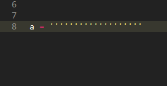

[github](https://github.com/willowj/sublime_plugin)

- 自定义新建文本名称、头部信息

~~~python
class New_file2(sublime_plugin.TextCommand):
    """docstring for new_file"""
    def run(self, edit):
        window = sublime.active_window()
        view = window.new_file()
        view.set_name('name.py')
        view.run_command("insert_snippet",
                         {"contents":
                          '#coding:utf8\n'
                          '#author: willowj\n'
                          '#license: MIT\n'
                          '#date: ' + datetime.datetime.now(
                              ).strftime("%Y-%m-%d %H:%M:%S")
                          }
                         )
~~~

- 3引号字符串''' ''''   /注释

  

 **自定义 sublime plugin 步骤：**

1. 写入代码
    Tools > developer > New plugin 
    或者路径：..\Sublime Text 3\Packages\User  (Packages 下的py文件如有更改 会自动重载)
2. 配置快捷键
   Preferrence > Key Bindings> User

~~~json
[
    {"anaconda_linting": false},
    {"keys": ["ctrl+shift+,"], "command": "add_current_time"},
    {"keys": ["ctrl+shift+-"], "command": "add_split_line"},
    {"keys": ["ctrl+shift+'"], "command": "wrap_3comma"},

    {"keys": ["ctrl+shift+."], "command": "new_file2"},
    {"keys": ["#"], "command": "inser_numbersign"},
    {"keys": ["ctrl+keypad0"], "command": "test1"}, // debug
    // {"keys": ["#"], "command": "run_macro_file", "args": {"file": "Packages/User/macro_2.sublime-macro"}},
]
~~~

​	keys 须是 sublime key/char evt 键盘事件
​	command 须是对应 自定义plugin 里class name （驼峰式转下划线 式——把非首字母的大写换成 '_'加小写）

开发环境tips：

view > show console (Ctrl+~),报错、输出都能看到；在plugin py文件中设置 

~~~python
sublime.log_input(True) 
sublime.log_commands(True)
~~~

sublime console 就会实时显示所有操作和执行情况

> key evt: backspace
> key evt: control+s
> reloading plugin User.my_sublime_plugin
> key evt: backspace
> key evt: backspace
> key evt: control+c

api：http://www.sublimetext.com/docs/3/api_reference.html
doc_example:http://www.sublimetext.com/docs/plugin-examples
http://www.sublimetext.com/docs/plugin-basics
http://www.sublimetext.com/docs/commands

python syntax_file  

> (type:tmLanguage) [  MattDMo/PythonImproved ](https://github.com/MattDMo/PythonImproved)
> sublime-syntax : [sublime  ](https://github.com/sublimehq/Packages/tree/master/Python)

